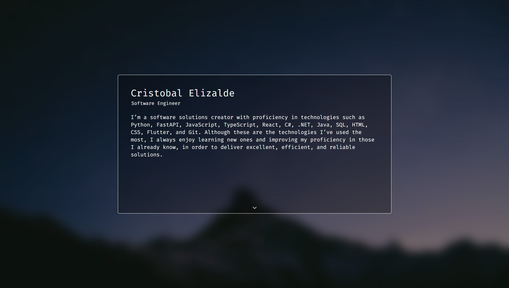

# Personal Portfolio

[](https://choosealicense.com/licenses/mit/)

This repository contains my personal web portfolio, showcasing my experience as a software developer.

The portfolio was fully designed and developed by me, with a focus on a clean and minimal UI for clarity.  
Some images used in the project were sourced from https://pixabay.com/.

🌐 **Live site:** https://crist-portfolio.vercel.app/

## 📸 Screenshots



## Run Locally

Clone the project

```bash
  git clone https://github.com/Decrist33/crist-portfolio.git
```

Go to the project directory

```bash
  cd crist-portfolio
```

Install dependencies

```bash
  pnpm install
```

Start the server

```bash
  pnpm run dev
```
